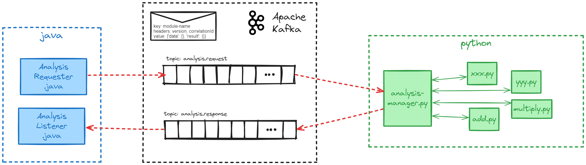

# java-kafka-python
*Integrating Java and Python via Kafka*

The main goal of this project is to connect Java with Python, in a request/response pattern. The flowchart shows how the code works: basically from **AnalysisRequester.java** we can send a message in the topic 'analysis.request', passing the desired module in the `msg.key` and the data in the `msg.value`. Then, the **analysis-manager.py** resolves it, using the proper inner module, and includes the returned result inside `msg.value`. Finally, the **AnalysisListener.java** just prints out the messages comming from the topic 'analysis.response'.



## Requirements

- OS: WSL with Arch Linux, clone repo:

```shell
cd ~/dev
git clone https://github.com/reisarthur/java-kafka-python.git
```

- Kafka 3.7.0 - run on docker:

```shell
cd ~/dev/java-kafka-python/kafka/
docker compose up
```

- Python 3.11 - create virtual environment, and install module kafka-python:

```shell
cd ~/dev/java-kafka-python/python/
python -m venv myenv
source myenv/bin/activate.fish
pip install kafka-python
```


## Usage

Run on three different tabs:

```shell
cd ~/dev/java-kafka-python/python/
python analysis-manager.py
```

```shell
cd ~/dev/java-kafka-python/java/analysis-requester
mvn exec:java -Dexec.mainClass="br.cepel.dga.AnalysisListener"
```

```shell
cd ~/dev/java-kafka-python/java/analysis-requester
mvn exec:java -Dexec.mainClass="br.cepel.dga.AnalysisRequester"
```
